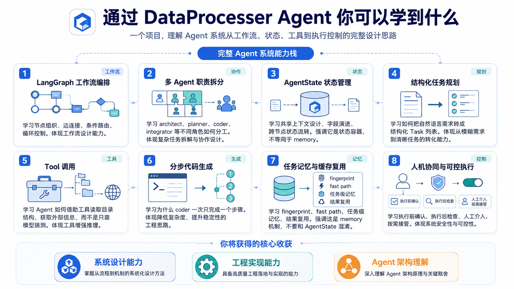
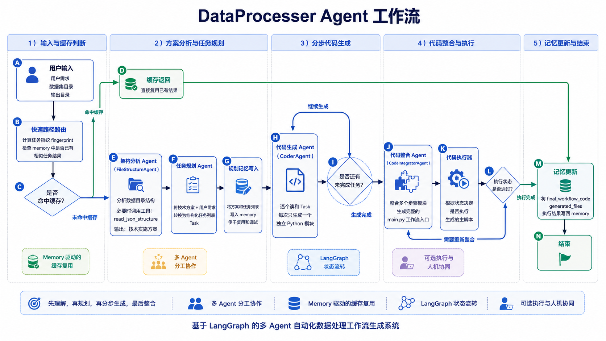

# data_process_agent

这是一个面向 LangGraph 与 Agent 实践的开源示例项目，围绕一个典型的数据处理 Agent 问题组织成完整链路：

`理解数据目录 -> 生成技术方案 -> 拆分任务 -> 逐步写代码 -> 整合主流程 -> 可选执行 -> 结果缓存`

这个仓库的目标不是提供一个重工程化的生产系统，而是提供一个结构清晰、便于阅读和扩展的多 Agent 样例，用于展示 LangGraph、结构化输出、工具调用、状态管理，以及任务在多个 Agent 之间的流转方式。

## 项目概览

假设用户给你一句需求，比如：

- “把这个数据集整理成训练 YOLO 所需的格式”
- “遍历目录里的 JSON 标注，抽取关键字段并输出成 CSV”
- “按目录结构批量清洗文件并生成标准化结果”

传统脚本做法通常是直接写一段大脚本。这个项目则显式拆开处理过程，重点展示：

- 一个 Agent 如何先理解目录结构，而不是立刻写代码
- 一个规划节点如何把自然语言需求转成结构化 `Task`
- 一个 coder 节点如何一次只负责一个子任务
- 一个 integrator 节点如何把多个步骤重新串成 `main.py`
- 一个 memory 模块如何减少重复生成

因此，这份实现更适合作为“数据处理 Agent 工作流模板”来参考和扩展。



## Teaching Goals

- 演示 `StateGraph` 如何组织多节点流程
- 演示一个典型多 Agent 链路如何分工
- 演示工具调用和结构化输出如何配合
- 演示 Agent 状态如何在 LangGraph 中逐步累积
- 演示简单的 memory fast path 如何减少重复计算
- 提供一个可裁剪、可扩展的基础模板

## 整体流程

项目的主工作流定义在 [workflow.py](./src/data_process_agent/workflow.py) 中，核心链路如下：



1. `fast_path_router`
   先根据用户需求、数据目录、输出目录等信息生成 fingerprint，检查 memory 里有没有近似已完成任务。

2. `architect`
   由 `FileStructureAgent` 分析目录结构，并在必要时调用 `read_json_structure` 工具，输出一个面向实现的技术方案。

3. `planner`
   把“技术方案 + 用户需求”转换成结构化 `Task` 列表。每个任务都描述一个清晰的数据处理步骤。

4. `planner_memory`
   将当前方案和任务列表写入 memory，方便后续复用和调试。

5. `coder`
   逐个读取 `Task`，每次只生成一个 Python 模块，避免一次性生成过于复杂的大脚本。

6. `integrator`
   读取前面生成的文件信息、函数摘要和函数签名，组合成一个完整的 `main.py` 工作流入口。

7. `code_executor`
   根据状态决定是否执行生成的主脚本。执行部分保持为可选环节，便于按需接入不同运行环境。

8. `memory_update`
   在流程结束时把最终结果写回 memory，为下一次命中 fast path 做准备。

如果用一句话总结，这个 Agent 的设计思想就是：

“先理解，再规划，再分步生成，最后整合，而不是一上来就让模型硬写一整个项目。”

## 为什么采用这个流程

很多 Agent 示例要么过于简化，只是单次 prompt 调用；要么过于工程化，难以快速理解主线设计。这个仓库选择了更适合展示核心机制的中间方案：

- 复杂度足以体现 LangGraph 的价值
- 同时避免引入过多基础设施依赖

整个结构比较适合说明下面这些问题：

- 为什么需要状态图，而不是简单函数链
- 为什么要把“目录理解”和“代码生成”拆成不同 Agent
- 为什么 `Task` 这种中间结构很重要
- 为什么要让 coder 一次只做一个步骤
- 为什么 memory 不只是聊天记忆，也可以是任务级缓存

## 每个模块值得学习什么

### `state.py`

这是整个工作流的共享上下文定义，也是理解状态流转的最佳入口之一。

可以重点关注：

- `AgentState` 如何作为全局上下文容器
- `Task`、`FileInfo`、`CoderOutput` 这些结构化模型的价值
- 为什么把自由文本需求，转成结构化任务，会让后续 Agent 更稳定

### `agents.py`

这里实现的是 `FileStructureAgent`。在职责划分上，这个节点先承担“架构师”角色，而不是直接进入代码生成。

适合拿来讲：

- Agent 的职责切分
- 如何把目录结构作为上下文传给模型
- 工具调用的基本模式
- 为什么“先理解数据，再决定代码结构”会更稳

### `tools.py`

这里提供了一个很小但很典型的工具：`read_json_structure`。

这个工具模块的参考点主要在于：

- Tool 不一定要复杂，关键是边界清晰
- 为什么工具最好返回“结构摘要”而不是整份原始内容
- 如何控制模型的观察范围，避免上下文爆炸

### `coder.py`

这里集中体现了结构化输出和分步代码生成的设计。

可以重点参考：

- 为什么 coder 一次只实现一个任务
- 为什么要求输出文件名、代码、函数摘要等结构化元信息
- 为什么生成代码时要同时生成机器可消费的 metadata

### `code_integrator.py`

这个模块展示了一个很实用的思路：让模型不是直接凭空组织大脚本，而是基于前面已生成的模块和函数签名完成整合。

这里值得重点关注：

- 多阶段生成比单阶段生成更可控
- 为什么先生成模块、再整合主流程
- 函数摘要和签名如何帮助后续 Agent 做更稳定的调用拼装

### `memory_store.py`

这个模块展示了“Agent memory 不只有对话记忆”这一点。

可以从这里展开：

- 什么是任务 fingerprint
- 什么是 planner memory 和 execution memory
- 为什么缓存最近一次已完成结果可以显著节省时间和 token
- 怎样把 Pydantic 对象安全地序列化落盘

### `workflow.py`

这是整个仓库最值得反复阅读的文件，因为 LangGraph 的核心思想都集中在这里。

这里可以重点关注：

- `StateGraph` 如何加节点
- 条件路由如何实现分支跳转
- fast path / cold path 的分流思路
- 多节点之间如何通过状态而不是直接函数参数耦合

## 可参考的设计点

- Agent 不只是“调用一次大模型”
- LangGraph 的价值在于显式建模流程和状态
- 中间结构设计会决定系统稳定性
- 多 Agent 系统的关键不是“Agent 越多越好”，而是职责边界清晰
- 让每个节点做一件小事，通常比让一个节点做所有事更稳
- 如何把工具调用和规划节点分开
- 如何设计可缓存的任务级 memory
- 如何把代码生成做成多阶段流水线
- 如何让测试尽量脱离可选依赖，比如 Docker

## 适合参考和二次改造的点

下面这些部分比较适合作为后续项目的起点：

- `AgentState` 设计
  适合作为任何 LangGraph 项目的状态模板参考。

- `Task` 中间层
  很适合迁移到文档处理、数据清洗、报表生成等场景。

- `fast_path_router`
  适合所有“相似任务反复出现”的 Agent 系统。

- `coder -> integrator`
  适合任何“先分步骤生成，再统一整合”的代码类 Agent。

- 延迟导入 Docker
  是一个很实用的工程小技巧，可以减少测试环境耦合。

## 当前实现的边界

为了保持主线清晰，这个仓库没有追求完整生产化。例如：

- memory 目前是本地 JSON 文件，不是数据库
- 执行模块是可选的，没有强耦合复杂沙箱系统
- prompt 设计保持了直观和可读，没有过度做 prompt engineering
- 没有引入复杂的 observability、重试策略、权限系统

这些取舍的目的，是将重点放在工作流建模、状态管理和多阶段生成流程本身。

## Project Layout

```text
data_process_agent/
  src/data_process_agent/
    agents.py
    coder.py
    code_executor.py
    code_integrator.py
    config.py
    data_reader.py
    memory_store.py
    state.py
    tools.py
    workflow.py
  tests/
    test_memory_workflow.py
```

## Quick Start

1. Create a virtual environment and install dependencies.
2. Copy `.env.example` to `.env` or export the same environment variables.
3. Import `build_workflow` and run the graph with your own dataset path.

```bash
pip install -e .
export OPENAI_API_KEY=your_key
python -m unittest discover -s tests
```

## Design Notes

- No secrets are stored in source code.
- Redis checkpointing is optional and disabled by default.
- Docker is imported lazily so unit tests do not require it unless you run execution.
- The package uses relative imports to make CI and contributor setup simpler.

## Recommended Reading Order

如果希望快速理解整个项目，建议按这个顺序阅读：

1. 从 [state.py](./src/data_process_agent/state.py) 开始，先讲全局状态和结构化模型。
2. 再看 [workflow.py](./src/data_process_agent/workflow.py)，建立“图”的整体心智模型。
3. 然后讲 `architect -> planner -> coder -> integrator` 这条主线。
4. 接着补充 [tools.py](./src/data_process_agent/tools.py) 和 memory 机制，说明 Agent 如何获得外部信息和复用旧结果。
5. 最后再看执行模块和工程化细节，理解一个 Agent 从原型走向实际系统时需要补齐哪些能力。

## 下一步可以怎么扩展

如果需要继续扩展这个项目，可以考虑：

- 增加一个 CLI 入口
- 提供一个最小示例数据集
- 增加 Mermaid 流程图
- 给每个节点补更完整的日志
- 增加失败重试和人工确认机制
- 把 memory 从 JSON 升级到数据库或向量检索

这也是这个仓库适合开源的原因之一：当前内容不是一个封闭成品，而是一个便于继续演化的基础实现。
